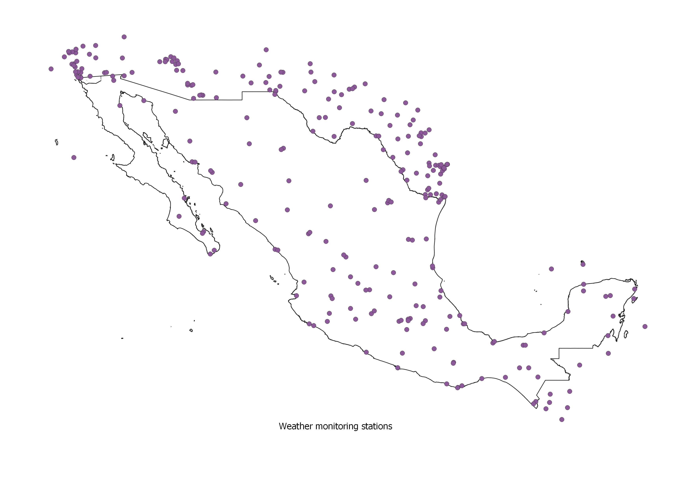
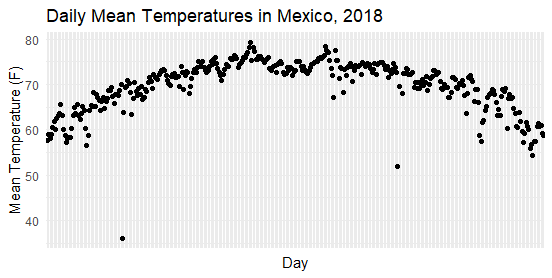

# clima_mun
Set average daily temperature to each municipality in Mexico

#### Objetive:
Estimate an average daily temperature to each municipality in Mexico according to Davis & Gertler (2015).

#### Data:
I use the Global Summary of the Day, from the US National Climatic Data Center https://www.ncei.noaa.gov/access/metadata/landing-page/bin/iso?id=gov.noaa.ncdc:C00516 .

#### Procedure:

* 01_clima_prepare <- Download, initial cleaning, and filtering of the data.
* 02_QGIS (not reproducible) <- Assign distances between municipalities and weather stations.
* 03_ipw <- Impute daily average temperature to each municipality using Inverse Distance Weights (IDW).
* 04_eda <- Data visualization (part of it was also done in QGIS).

#### Visualization:

#### References:
Davis, L. W., & Gertler, P. J. (2015). Contribution of air conditioning adoption to future energy use under global warming. Proceedings of the National Academy of Sciences, 112(19), 5962-5967.
